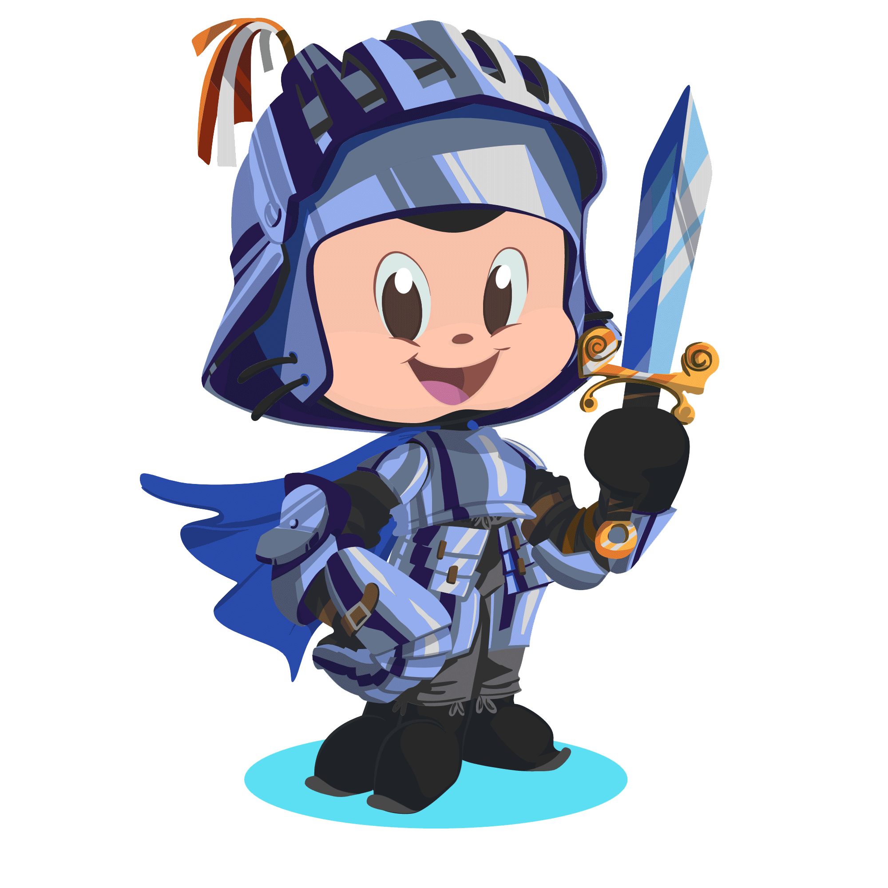

# Hi there, I’m Nattarintra 👋

Software engineer skilled in React, TypeScript, and Node.js with experience worked on Ubisoft Connect and fullstack web projects. Passionate about building user-friendly and high performance digital solutions. Ready for new challenges that push me to learn and grow. Motivated to continue developing my skills in both frontend and backend technologies while contributing to impactful projects in collaborative teams.

## 🚀 Skills

- Programming Languages: React, TypeScript, JavaScript 📚
- Front-end: React, Next.js, TypeScript,HTML, CSS (Bootstrap 5) 🎨
- Back-end: Node.js, C# .Net, PHP, MySQL 🖥️
- Testing: Test Automatiction, TDD & BDD, Cucumber , Selenium🧪
- Version Control: GitHub, GitLab, Bitbucket 🔄

## 📫 How to reach me

Feel free to reach out if you have any questions or if you just want to chat about coding!

## 🛠️ Tools I Use

  

<!---
Nattarintra/Nattarintra is a ✨ special ✨ repository because its `README.md` (this file) appears on your GitHub profile.
You can click the Preview link to take a look at your changes.
--->
